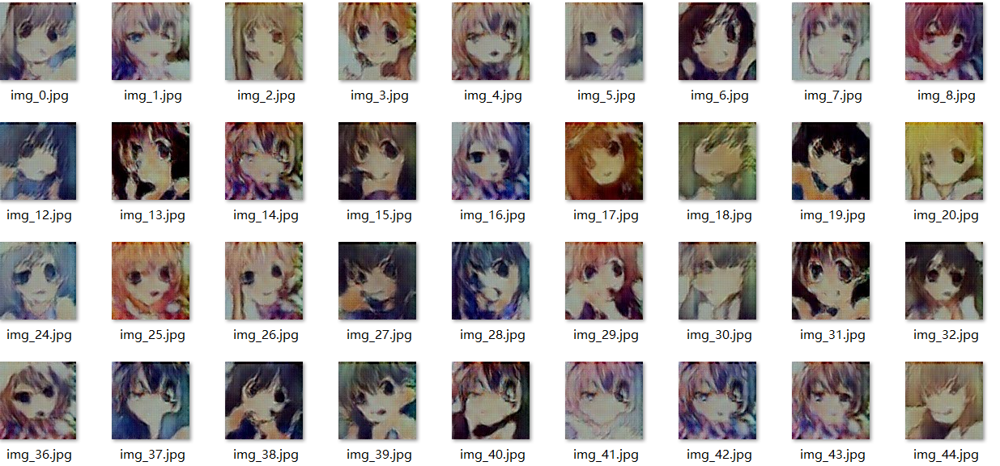

# Cartoon_Gan

实现一个简单的对抗网络，可以生成动漫头像。

## Quick Start

1. 克隆项目到本地
2. 下载动漫头像数据集 https://pan.baidu.com/s/1Yn53uxFLCbja13_6Ay44MA， 解压到`data/` 目录
3. 训练模型 `python train.py`
4. 测试 `python demo.py`

## Note

pkl文件夹下提供了训练69个epoch的模型，可以直接测试效果

## License

开源项目

